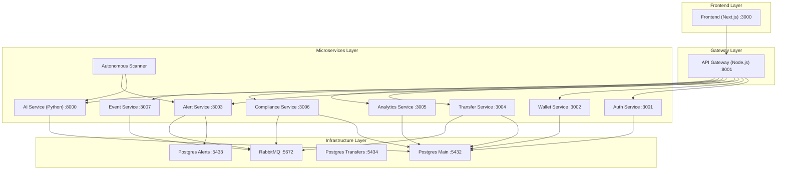

# Blockchain AI Sentinel - Microservices Edition 🚀

A state-of-the-art, fully decoupled microservices platform for real-time blockchain threat detection, risk management, and AI-driven compliance.

## 🏗️ Architecture Overview

The system has been migrated from a monolithic architecture to a robust, 14-container microservices stack.



## 🛠️ Key Features

- **Decoupled Architecture**: Each domain logic is isolated in its own service.
- **Centralized API Gateway**: Single entry point with JWT authentication, rate limiting, and observability.
- **Real-time Observability**: request tracing via `x-correlation-id` and structured JSON logging.
- **Event-Driven**: Asynchronous communication via RabbitMQ for high throughput.
- **AI-Powered**: Dedicated Python AI service for deep transaction analysis and risk scoring.
- **Autonomous Scanner**: Background scanner that monitors the chain and flags threats in real-time.

## 🚀 Getting Started

### Prerequisites
- Docker & Docker Compose
- Node.js 18+ (for local development)

### One-Click Deployment
Simply run the following command in the root directory:
```bash
docker-compose up -d --build
```

### Accessing the System
- **Frontend**: http://localhost:3000
- **API Gateway**: http://localhost:8001
- **RabbitMQ Dashboard**: http://localhost:15672 (admin/admin123)

## 📁 Project Structure

- `/services`: Core microservices (Auth, Wallet, Transfer, etc.)
- `/frontend`: Next.js web application
- `/backend`: Legacy code (Archived)
- `docker-compose.yml`: Root orchestration file

## 🛡️ Security & Observability

- **Security**: Helmet, CORS, and JWT protection on all private routes.
- **Observability**: Every request is assigned a `x-correlation-id` at the Gateway, which is forwarded to all downstream services for end-to-end tracing in logs.

---
© 2026 Blockchain AI Sentinel Team. Managed by Sentinel Prime AI.
