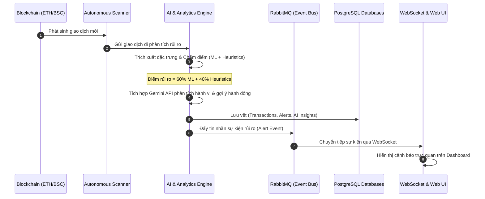

# 🛡️ Blockchain AI Sentinel - Tổng Quan Dự Án

**Blockchain AI Sentinel** là một nền tảng giám sát giao dịch blockchain thời gian thực, phát hiện rủi ro, phòng chống gian lận tài chính và hỗ trợ tuân thủ pháp lý (Compliance). Hệ thống được thiết kế theo kiến trúc **Microservices (14 container)**, kết hợp giữa các thuật toán **Heuristics**, mô hình **Machine Learning (Random Forest)** và **Generative AI (Google Gemini LLM)** để tự động nhận diện và phân tích sâu các hành vi bất thường trên chuỗi (on-chain).

---

## 🏗️ Kiến Trúc Hệ Thống (Architecture Overview)

Dự án đã được di chuyển từ kiến trúc Monolith sang mô hình **Microservices** hoàn chỉnh bao gồm các lớp chính:
1. **Frontend Layer**: Giao diện người dùng Next.js, hiển thị các chỉ số rủi ro trực quan và giao tiếp với hệ thống qua API Gateway.
2. **Gateway Layer**: API Gateway chịu trách nhiệm định tuyến, xác thực JWT, và giới hạn tần suất yêu cầu (rate limiting).
3. **Microservices Layer**: Nhóm các dịch vụ độc lập thực hiện các nghiệp vụ riêng biệt (xác thực, quản lý ví, chấm điểm AI, giám sát tuân thủ, phát tín hiệu cảnh báo).
4. **Infrastructure Layer**: Hệ thống truyền tin bất đồng bộ (RabbitMQ) và hệ thống lưu trữ cô lập (3 cơ sở dữ liệu PostgreSQL và SQLite cho môi trường local/Hugging Face).
5. **Scanner & AI Engine**: Bộ quét chuỗi tự động (Scanner) hoạt động ngầm kết hợp với dịch vụ AI phân tích sâu để đưa ra cảnh báo tức thì.

---

## 📊 Bảng Các Dịch Vụ & Thành Phần Hệ Thống (Services & Components)

Dưới đây là chi tiết về 14 dịch vụ chính được định nghĩa trong cấu hình Docker Compose:

| STT | Tên Dịch Vụ / Container | Công Nghệ Chính | Cổng (Port) | Vai Trò & Chức Năng Chính |
|:---:|:---|:---|:---:|:---|
| **1** | **frontend** | React, Next.js 14, Tailwind CSS, Recharts | `3000` | Dashboard trực quan phong cách Glassmorphism, hiển thị biểu đồ rủi ro, hàng đợi cảnh báo và chatbot hỗ trợ. |
| **2** | **api-gateway** | Node.js, Express | `8001` | Cổng vào duy nhất; định tuyến thông minh đến các dịch vụ con, xác thực JWT, giới hạn tần suất (Rate Limiting). |
| **3** | **auth-service** | Node.js, Express, PostgreSQL | `3001` | Quản lý người dùng, đăng ký, đăng nhập và cấp phát token JWT bảo mật. |
| **4** | **wallet-service** | Node.js, Express, PostgreSQL | `3002` | Quản lý thông tin ví, nhãn địa chỉ ví (labels) và lịch sử hoạt động của ví. |
| **5** | **alert-service** | Node.js, Express, PostgreSQL, RabbitMQ | `3003` | Quản lý hàng đợi cảnh báo (Alert Queue), lưu trữ và cập nhật trạng thái các cảnh báo rủi ro. |
| **6** | **transfer-service** | Node.js, Express, PostgreSQL, RabbitMQ | `3004` | Xử lý các yêu cầu chuyển tiền bảo vệ, lưu lại vết kiểm toán (Audit Trail). |
| **7** | **analytics-service** | Python, FastAPI, PostgreSQL | `3005` | Thu thập dữ liệu giao dịch từ blockchain (qua Alchemy/Etherscan) và trích xuất các đặc trưng (Features). |
| **8** | **compliance-service**| Node.js, Express, PostgreSQL, RabbitMQ | `3006` | Giám sát chính sách tuân thủ, quản lý danh sách đen (Blacklist) và các giao dịch bị chặn. |
| **9** | **event-service** | Node.js, WebSocket, RabbitMQ | `3007` | Phát sóng các sự kiện thời gian thực (real-time events) lên giao diện người dùng qua giao thức WebSocket. |
| **10** | **ai-service** | Python, FastAPI, PostgreSQL | `8000` | Chạy bộ máy phát hiện đa tác vụ (Multi-Agent AI Engine), kết hợp ML và tích hợp Gemini API để lý giải mối đe dọa. |
| **11** | **scanner** | Python | *Chạy nền* | Bộ quét tự động theo dõi các block mới trên blockchain, phát hiện các giao dịch đáng ngờ và gửi tới Alert Service. |
| **12** | **rabbitmq** | RabbitMQ (Message Queue) | `5672` / `15672` | Hệ thống hàng đợi tin nhắn bất đồng bộ, giúp truyền dữ liệu sự kiện giữa các microservices một cách tin cậy. |
| **13** | **postgres_main** | PostgreSQL 16 | `5432` | Lưu trữ dữ liệu chung (Người dùng, Ví, Chính sách tuân thủ, Nhật ký hệ thống). |
| **14** | **postgres_alerts** | PostgreSQL 16 | `5433` | Cơ sở dữ liệu riêng biệt phục vụ lưu trữ cảnh báo (Alerts) và mức độ đe dọa nhằm tối ưu hiệu năng. |
| **15** | **postgres_transfers**| PostgreSQL 16 | `5434` | Cơ sở dữ liệu riêng biệt lưu trữ lịch sử chuyển khoản bảo vệ và nhật ký kiểm toán. |

---

## 🔑 Phân Quyền Người Dùng (Role-Based Access Control - RBAC)

Giao diện hệ thống tự động thay đổi dựa trên 4 vai trò chuyên biệt của người vận hành:

| Vai Trò (Role) | Đối Tượng Sử Dụng | Chức Năng & Quyền Hạn Trên Dashboard |
|:---|:---|:---|
| **System Admin** | Quản trị viên hệ thống | - Giám sát sức khỏe của các node mạng và endpoint.<br>- Theo dõi độ trễ API (p95), dung lượng database.<br>- Xem nhật ký chẩn đoán (Diagnostic Logs) và khôi phục hệ thống khi có sự cố. |
| **AI Data Engineer**| Kỹ sư dữ liệu AI | - Quản lý kho đặc trưng (Feature Store) và quy trình chuẩn bị dữ liệu.<br>- Đăng ký và theo dõi phiên bản của các mô hình ML (Model Registry).<br>- Giám sát hiệu suất mô hình (Accuracy, F1-score) và posture của pipeline. |
| **Security Analyst**| Chuyên viên phân tích bảo mật | - Quản lý hàng đợi cảnh báo rủi ro (Alert Queue).<br>- Phân tích chi tiết các ví có điểm rủi ro cao (High-risk Wallets).<br>- Xem lý giải mối đe dọa bằng AI (AI-generated threat logs) và đưa ra quyết định khóa ví / đưa vào danh sách theo dõi. |
| **Compliance Manager**| Quản lý tuân thủ pháp lý | - Thiết lập và phê duyệt các chính sách kiểm soát (Policy Rules).<br>- Theo dõi báo cáo các chỉ số tuân thủ (Compliance KPIs) và lượng tiền bị chặn.<br>- Xem vết kiểm toán (Audit Trails) để phục vụ thanh tra và đảm bảo tính minh bạch. |

---

## ⚡ Các Tính Năng & Chức Năng Nổi Bật (Core Features)

### 1. Bộ Máy Phát Hiện Đa Tác Vụ (Multi-Agent Detection Engine)
Hệ thống sử dụng các Agent chuyên biệt để nhận diện các hành vi gian lận tài chính phức tạp:
* **Money Laundering Agent (Phòng chống rửa tiền)**: Phát hiện hành vi gom/chia nhỏ dòng tiền (Structuring) dựa trên biến động giao dịch trong các cửa sổ thời gian hẹp; phát hiện tương tác trực tiếp với các bộ trộn tiền mã hóa (như Tornado Cash).
* **Wash Trading Agent (Thao túng thị trường)**: Phát hiện hành vi giao dịch qua lại tuần hoàn (A ⇄ B) trong thời gian ngắn và các hành vi giao dịch tần suất cực cao mô phỏng bot.
* **Scam & Honeypot Agent (Phòng chống lừa đảo)**: Nhận diện các ví rác vừa tạo có lượng tiền nạp khổng lồ không rõ nguồn gốc (Disposable wallet) và đối chiếu danh sách đen (Blacklist).

### 2. Mô Hình Học Máy Chấm Điểm Rủi Ro (Hybrid AI Risk Scoring)
Hệ thống kết hợp hai phương thức chấm điểm tạo ra một điểm số rủi ro từ **0 đến 100**:
* **Chỉ số Heuristics (40%)**: Chấm điểm dựa trên các quy tắc nghiệp vụ cứng đã được định nghĩa.
* **Chỉ số Machine Learning (60%)**: Sử dụng mô hình **Random Forest** đã được huấn luyện sẵn (`risk_model.pkl`) để dự đoán xác suất gian lận dựa trên các đặc trưng giao dịch được trích xuất.
* **Cơ chế Override**: Nếu ví nằm trong danh sách đen (Blacklist Match), hệ thống sẽ lập tức ghi đè điểm rủi ro lên **99 (Critical)** mà không cần qua bộ lọc khác.

### 3. Trợ Lý AI Bảo Mật & Giải Thích Rủi Ro (Explainable AI - XAI)
* **Tích hợp Google Gemini API**: Khi phát hiện ví có điểm rủi ro cao, hệ thống tự động gửi ngữ cảnh đến Gemini LLM để tạo ra một bản báo cáo phân tích mối đe dọa bằng **tiếng Việt tự nhiên**.
* **Đề xuất hành động thông minh**: Dựa trên phân tích, AI sẽ tự động đề xuất thẻ hành động tương ứng như `[ACTION: BLOCK_WALLET]` (Khóa ví) đối với rủi ro cực lớn (>70), hoặc `[ACTION: WATCHLIST]` (Theo dõi sát) đối với rủi ro trung bình (40-70).
* **Chatbot Dashboard (Sentinel Prime)**: Một trợ lý trò chuyện tích hợp ở góc màn hình giúp người vận hành truy vấn nhanh các chỉ số hệ thống, giải thích thuật ngữ tuân thủ, hoặc chẩn đoán trạng thái các service bằng ngôn ngữ tự nhiên.

### 4. Quản Lý Sự Vụ & Báo Cáo Tuân Thủ (Case Management & Compliance Reporting)
* **Quy trình Case Management**: Các ví bị gắn cảnh báo sẽ được nhóm thành các sự vụ (Cases) để bộ phận bảo mật điều tra, cập nhật trạng thái (Pending, Investigating, Resolved) và lưu lại các bằng chứng.
* **Compliance Snapshot**: Tự động chụp các bản ghi (snapshots) hàng ngày về lượng tiền đã chặn, tỷ lệ hiệu quả của các chính sách, và các lỗ hổng hồ sơ bằng chứng tuân thủ để phục vụ báo cáo định kỳ.

---

## 🔄 Quy Trình Hoạt Đông Của Hệ Thống (Workflow)



---

## 🛠️ Hướng Dẫn Vận Hành Nhanh (Getting Started)

### 1. Khởi động toàn bộ hệ thống bằng Docker Compose:
Chạy lệnh sau tại thư mục gốc của dự án để khởi động cả 14 container:
```bash
docker-compose up -d --build
```

### 2. Các địa chỉ truy cập cục bộ:
* **Giao diện người dùng (Frontend)**: http://localhost:3000
* **API Gateway (Điểm truy cập API chung)**: http://localhost:8001
* **Bảng điều khiển RabbitMQ**: http://localhost:15672 (Tài khoản: `admin` / Mật khẩu: `admin123`)
* **API chẩn đoán hệ thống (Admin Status)**: http://localhost:8001/admin/diagnostics/status

### 3. Cấu hình biến môi trường (.env):
Đảm bảo bạn đã sao chép tệp `.env.example` thành `.env` và cung cấp khóa API cần thiết:
* `GEMINI_API_KEY`: Khóa API từ Google AI Studio để kích hoạt Trợ lý AI phân tích và giải thích rủi ro bằng tiếng Việt.
* `ALCHEMY_API_KEY`: Khóa kết nối mạng RPC để quét dữ liệu blockchain thật.

---
*Tài liệu được biên soạn và cập nhật vào tháng 5, 2026 bởi Sentinel Prime AI.*
